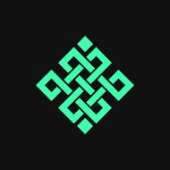

# Rialo Calls

**Where the Community Calls What Happens Next**

---

## 🔮 Overview

**Rialo Calls** is a fully on-chain prediction market where the community bets on real events. Every prediction is created on-chain, every bet is a signed transaction, and every payout is trustlessly claimable — no custodian, no middleman.

Live at → **[rialocalls.vercel.app](https://rialocalls.vercel.app)**

---

## How It Works

| Step | Action |
|---|---|
| 🗳️ **Call** | Vote YES or NO on community-driven predictions |
| 💰 **Win** | Correct callers split the losing pool proportionally |
| 🏆 **Climb** | Earn badges and rise the on-chain leaderboard |
| 🔮 **Be remembered** | The chain records who called it right |

---

## Tech Stack

| Layer | Technology |
|---|---|
| Frontend | React 18 + Vite |
| Blockchain | Wagmi v2 · Viem · RainbowKit |
| Database | Supabase |
| Deployment | Vercel |

---

## License

MIT © Rialo Calls
